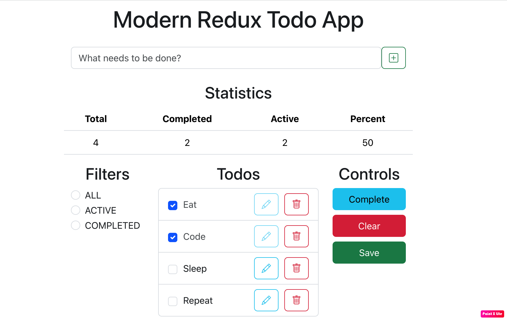

# Todo Application
This application is designed to facilitate task management by allowing users to download a list of to-do items from a simulated database. Users can perform various actions such as deleting, editing, creating, and adding new items within the application. To save changes made to the to-do list and update the database, a dedicated button has been incorporated along with the necessary functionality.

Furthermore, the application offers additional features including the ability to delete all completed to-do items simultaneously, as well as mark all items as completed. Users can also access simple statistics related to the to-do list items. Additionally, the application provides filtering functionality to streamline task organization.
## Technologies used:
- React
- React-redux
- @reduxjs/toolkit
- Axios
- Json Server
- Concurrently
- React-bootstrap
- Bootstrap
- Bootstrap-icons
- Nanoid
### Visual display of the developed application

